# 다듬 (Dadeum)

> **AI 기반 프레젠테이션 슬라이드 디자인 일관성 분석 서비스**
>
> PPTX / PDF를 업로드하면 30초 내에 어떤 슬라이드가 왜 튀는지를 수치와 근거로 알려준다.


---

## 목차

| | 섹션 | 대상 독자 |
|--|------|---------|
| 1 | [데모 & 스크린샷](#1-데모--스크린샷) | 모두 |
| 2 | [왜 다듬인가](#2-왜-다듬인가) | 모두 |
| 3 | [주요 기능](#3-주요-기능) | 모두 |
| 4 | [기술 스택 & 아키텍처](#4-기술-스택--아키텍처) | 개발자 |
| 5 | [기술적 도전 과제](#5-기술적-도전-과제) | 개발자 / 면접관 |
| 6 | [AI 파이프라인 상세](#6-ai-파이프라인-상세) | 개발자 / 연구자 |
| 7 | [연구 배경](#7-연구-배경) | 연구자 |
| 8 | [한계와 향후 연구 과제](#8-한계와-향후-연구-과제) | 모두 |
| 9 | [로컬 실행 방법](#9-로컬-실행-방법) | 개발자 |
| 10 | [프로젝트 구조](#10-프로젝트-구조) | 개발자 |

---

## 1. 데모 & 스크린샷

> 🎬 **[데모 영상 보기](데모_영상_링크)** — 파일 업로드부터 분석 결과 확인까지 전체 흐름 (약 2분)

---

### 업로드 화면

PPTX 또는 PDF를 드래그 앤 드롭하거나 클릭하여 선택한다.

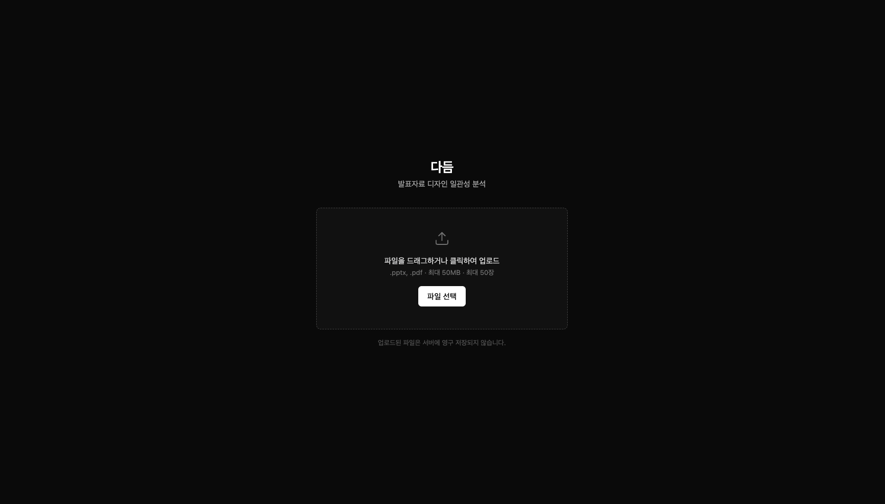

---

### 일관성 점수 & 발표 구조 분석

전체 점수(0~100)와 폰트·색상·레이아웃·콘텐츠 세부 점수, 발표 역할 흐름을 한 화면에서 확인한다.

각 이상 유형별 결과 화면:

| 색상 이상 | 콘텐츠 이상 |
|:--------:|:---------:|
| 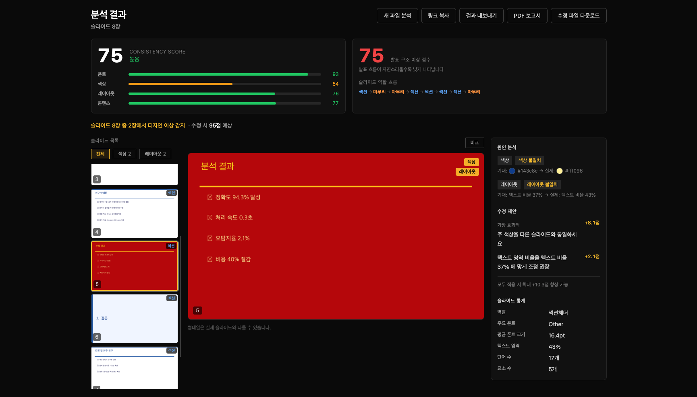 | 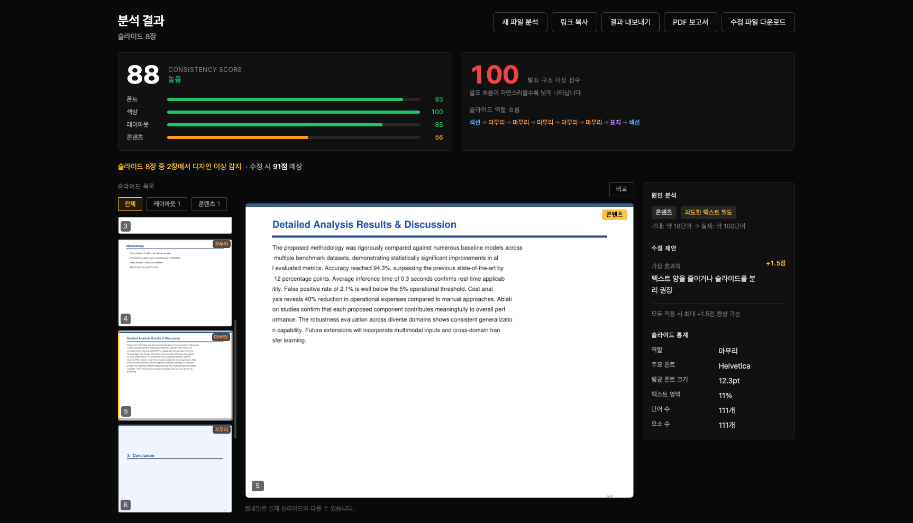 |

| 폰트 이상 | 레이아웃 이상 |
|:--------:|:-----------:|
| 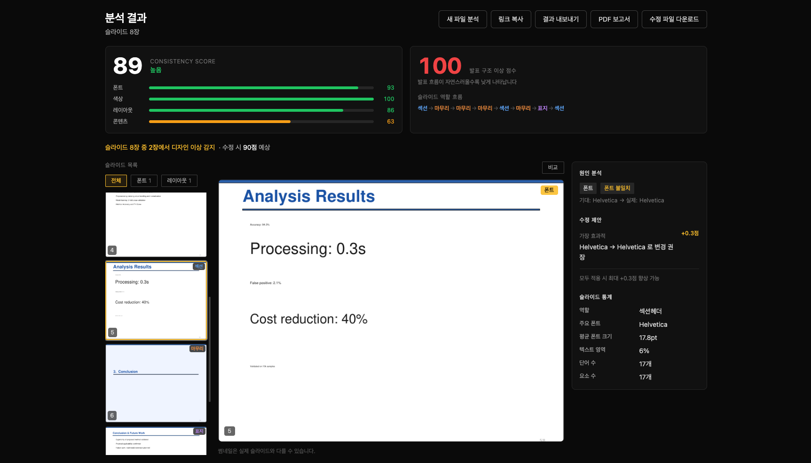 | 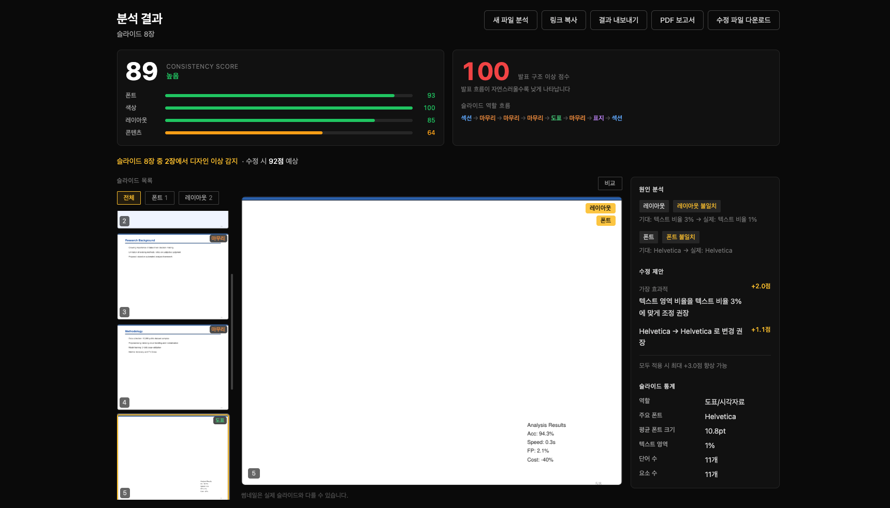 |

---

### 이상 슬라이드 탐지 & 원인 분석

이상이 탐지된 슬라이드는 주황색 테두리로 강조된다. 오른쪽 패널에서 원인("기대값 vs 실제값")과 수정 제안을 확인할 수 있다.

| 색상 불일치 | 콘텐츠 과밀 |
|:----------:|:---------:|
| 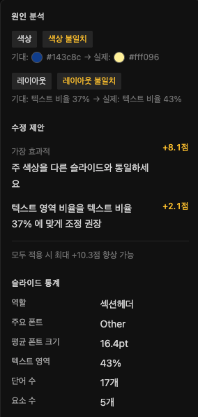 | 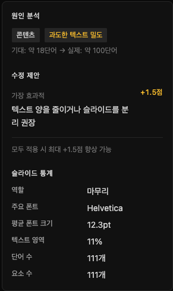 |

| 폰트 불일치 | 레이아웃 불일치 |
|:----------:|:------------:|
| 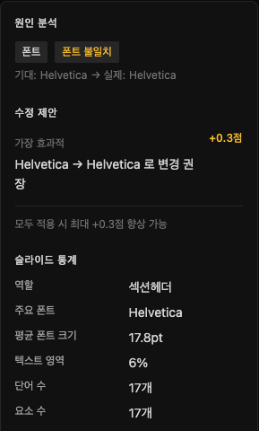 | 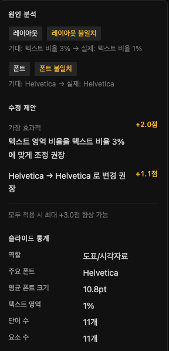 |

---

### 슬라이드 비교 모드

두 슬라이드를 나란히 놓고 폰트·크기·텍스트 영역·단어 수·역할을 수치로 비교한다. 차이가 있는 항목은 자동 강조된다.

| | | |
|:---:|:---:|:---:|
| 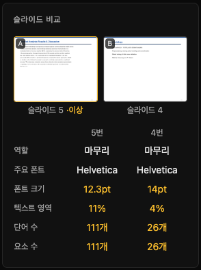 | 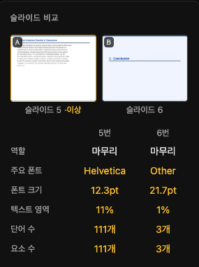 | 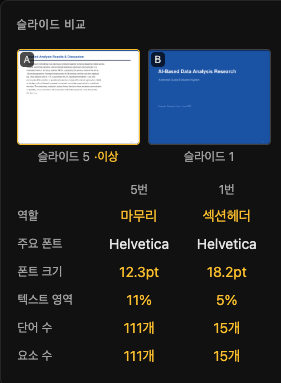 |

---

### PDF 보고서

분석 결과 전체(일관성 점수, 이상 슬라이드 썸네일, 원인, 수정 제안)를 PDF 문서로 다운로드한다. 팀 공유 및 기록용으로 활용할 수 있다.

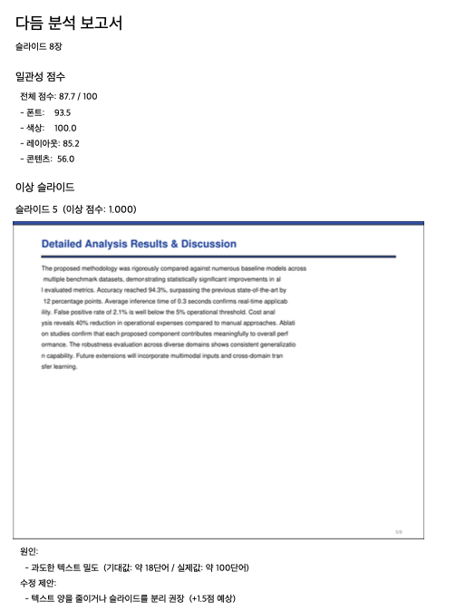

---

### 결과 내보내기 (JSON Export)

분석 결과 전체를 JSON 파일로 다운로드한다. 원시 데이터 활용, 추가 분석, 외부 도구 연동에 사용할 수 있다.

내보내는 JSON에는 아래 정보가 포함된다.

```json
{
  "consistency_score": {
    "total": 87.75,
    "sub_scores": { "typography": 93.49, "color": 100.0, "layout": 85.16, "content": 56.05 }
  },
  "outlier_slides": [
    {
      "slide_index": 4,
      "anomaly_score": 1.0,
      "root_causes": [{ "feature_group": "content", "label": "과도한 텍스트 밀도",
                        "expected_value": "약 18단어", "actual_value": "약 100단어" }],
      "recommendations": [{ "action": "텍스트 양을 줄이거나 슬라이드를 분리 권장",
                            "impact_score_delta": 1.51 }]
    }
  ],
  "impact_score_after_fix": 90.63,
  "slide_stats": [
    { "slide_index": 4, "word_count": 111, "font_size_mean": 12.3,
      "text_area_ratio": 0.1146, "dominant_font": "Helvetica", "slide_role": 4 }
  ],
  "role_sequence": [1, 4, 4, 4, 4, 4, 0, 1],
  "hmm_anomaly_score": 1.0
}
```

| 필드 | 설명 |
|------|------|
| `consistency_score` | 전체 일관성 점수 + 폰트·색상·레이아웃·콘텐츠 세부 점수 |
| `outlier_slides` | 이상 슬라이드 목록 + 원인 분석 + 수정 제안 |
| `impact_score_after_fix` | 수정 제안 모두 적용 시 예상 점수 |
| `slide_stats` | 슬라이드별 단어 수·폰트 크기·텍스트 비율·역할 통계 |
| `role_sequence` | CNN이 예측한 슬라이드별 역할 시퀀스 |
| `hmm_anomaly_score` | 발표 구조 이상 점수 (0~1) |

---

> 📁 스크린샷 파일 위치: `docs/screenshots/`

---

## 2. 왜 다듬인가

### 문제: 사람 눈으로는 못 잡는 불일치

50장짜리 발표자료에서 3장만 폰트가 다르다고 해보자. 슬라이드를 한 장씩 넘기며 이걸 발견하는 사람은 거의 없다. **사람은 바로 앞 슬라이드와 비교하지, 전체 50장을 동시에 비교하지 않는다.**

불일치가 쌓이는 전형적인 상황:
- 팀원이 각자 만든 슬라이드를 하나로 합칠 때
- 오래된 템플릿 위에 새 슬라이드를 덧붙일 때
- 마감 직전 다른 소스에서 복사·붙여넣기 할 때

그 결과는 작지 않다.

| 상황 | 청중이 받는 인상 |
|------|----------------|
| 자기소개 PPT의 폰트가 슬라이드마다 다름 | 세심하지 못하다 |
| IR Deck 3장만 색상 톤이 다름 | 브랜드 일관성 없다, 전문성 부족 |
| 학위 발표 중 레이아웃이 흐트러짐 | 내용보다 형식이 눈에 띈다 |

### 해결: 덱 전체를 하나의 집합으로 분석

다듬은 슬라이드를 개별적으로 평가하지 않는다. **덱 전체의 분포를 먼저 파악하고, 그 분포에서 벗어나는 슬라이드를 찾는다.**

각 슬라이드를 59차원 피처 벡터(폰트·색상·레이아웃·콘텐츠)로 변환한 뒤 Isolation Forest로 이탈 점수를 계산한다. 이상이 탐지되면 어느 피처 그룹에서 가장 크게 벗어났는지를 분석하여 구체적인 근거와 수정 제안을 함께 제시한다.

```
슬라이드 8번  이상 점수 0.97

  원인:  색상 불일치
         기대값: RGB(255, 255, 255)  ← 나머지 47장의 주 색상
         실제값: RGB(20, 20, 30)     ← 이 슬라이드만 어두운 계열

  제안:  주 색상을 다른 슬라이드와 통일하세요  (+10.6점 예상)
```

### 기존 방법과의 비교

| 방법 | 덱 전체 비교 | 근거 제시 | 기존 파일 지원 |
|------|:-----------:|:--------:|:------------:|
| 직접 눈으로 검수 | ❌ | ❌ | ✅ |
| PowerPoint Designer | ❌ (슬라이드 단위) | △ | ✅ |
| Canva / Figma | ❌ | ❌ | ❌ |
| 디자이너 의뢰 | △ | △ (주관적) | ✅ |
| **다듬** | **✅** | **✅ (수치)** | **✅** |

### 주요 사용자

| 페르소나 | 상황 | 다듬으로 얻는 것 |
|----------|------|----------------|
| 취업 준비생 | 포트폴리오 PPT 마감 전날 | 이상한 슬라이드 + 이유를 30초 안에 파악 |
| 대학생 | 팀플 슬라이드 합치기 후 검수 | 통일감 깨는 슬라이드를 수치로 특정 |
| 스타트업 | IR Deck 투자자 발표 전 | 브랜드 일관성 + 발표 흐름 구조 점검 |

---

## 3. 주요 기능

### 🎯 일관성 점수 (Consistency Score)

발표 전체를 4개 축으로 **0~100점** 채점한다. 점수가 낮을수록 특정 슬라이드가 전체 경향에서 크게 벗어나 있다.

| 축 | 가중치 | 측정 내용 |
|----|:------:|----------|
| 폰트 (Typography) | 30% | 폰트 종류 분포, 크기 통계, Bold/Italic 비율 |
| 색상 (Color) | 30% | 지배 색상 RGB, 배경색, 채도·밝기 |
| 레이아웃 (Layout) | 25% | 텍스트·이미지 면적, 정렬 비율, 4방향 여백 |
| 콘텐츠 (Content) | 15% | 단어 수, 불릿 수, 텍스트 밀도 |

"색상 55점 / 폰트 89점" → 수정 우선순위가 색상임을 바로 알 수 있다.

---

### 🔍 이상 슬라이드 탐지

**Isolation Forest** 비지도 학습으로 전체 덱에서 상대적으로 튀는 슬라이드를 자동 검출한다. 사전 레이블이 전혀 필요 없다 — 같은 덱 안에서 상대적 이탈을 측정한다.

탐지 민감도는 슬라이드 수에 따라 자동 조정된다.

```
 5장 이하  →  contamination 0.15
15장 이하  →  contamination 0.20
15장 초과  →  contamination 0.25
```

---

### 🧠 원인 분석 & 수정 제안

이상 슬라이드를 찾은 뒤, 어떤 피처 그룹에서 가장 크게 벗어났는지를 코사인 유사도로 분석한다. 결과는 "기대값 vs 실제값" 형태로 제시된다.

수정 제안과 함께 점수 향상 예측치도 계산한다.

```
제안: 폰트 크기 36pt → 24pt로 조정 권장     (+3.2점 예상)
제안: 주 색상을 다른 슬라이드와 통일하세요  (+10.6점 예상)
──────────────────────────────────────────
모두 적용 시  77점 → 최대 92점 향상 가능
```

수정 제안이 반영된 **PPTX/PDF 파일 다운로드**도 지원한다.

---

### 📐 슬라이드 비교 모드

두 슬라이드를 나란히 놓고 폰트·크기·텍스트 영역·단어 수·역할을 수치로 비교한다. 차이가 있는 항목은 자동 강조 표시된다. 팀원이 서로 다른 스타일로 만든 슬라이드를 맞출 때 유용하다.

---

### 📊 발표 구조 분석 *(실험적 기능)*

> ⚠️ **현재 참고용 기능이다.** CNN 역할 분류 정확도(26%) 한계로 신뢰도가 낮다. 자세한 내용은 [한계와 향후 연구 과제](#8-한계와-향후-연구-과제)를 참고.

CNN으로 각 슬라이드의 역할(표지·섹션·본문·도표·마무리)을 분류하고, 역할 흐름의 이상 여부를 규칙 기반으로 판단한다.

```
정상:  표지 → 섹션 → 본문 → 본문 → 마무리
이상:  본문 → 마무리 → 표지 → 섹션 → 본문
              ↑ 마무리가 중간에 등장
```

---

### 📄 PDF 보고서

분석 결과 전체(일관성 점수, 이상 슬라이드 목록, 원인·수정 제안)를 PDF로 다운로드한다. 팀 공유, 디자이너 의뢰, 포트폴리오 기록용으로 활용할 수 있다.

---

## 4. 기술 스택 & 아키텍처

### 기술 스택

**Frontend**

| | 라이브러리 | 역할 |
|--|-----------|------|
| UI | React 18 + TypeScript (strict) | 컴포넌트 |
| 빌드 | Vite | 개발 서버 & 번들링 |
| 스타일 | TailwindCSS v3 | 유틸리티 CSS |
| 상태 | React Query | 서버 상태 + 1.5초 폴링 |
| 라우팅 | React Router v6 | SPA 라우팅 |
| HTTP | Axios | API 클라이언트 |

**Backend**

| | 라이브러리 | 역할 |
|--|-----------|------|
| API | FastAPI + Pydantic v2 | REST API + 스키마 검증 |
| PPTX | python-pptx | 파싱 & 수정 |
| PDF | pdfplumber + pymupdf | 텍스트 추출 & 렌더링 |
| 보고서 | fpdf2 | PDF 생성 |

**AI Pipeline**

| | 라이브러리 | 역할 |
|--|-----------|------|
| 이상 탐지 | scikit-learn | Isolation Forest |
| CNN | PyTorch + timm | EfficientNet-B3 역할 분류 |
| 이미지 | Pillow + NumPy | 피처 추출 & 렌더링 |

---

### 아키텍처

```
┌──────────────────────────────────────────────────────────────┐
│                  Browser  (React + Vite)                      │
│                                                               │
│  UploadPage                  ResultPage                       │
│  └─ 드래그 앤 드롭            ├─ ConsistencyScoreCard         │
│                               ├─ StructureScoreCard (실험)    │
│                               ├─ SlideGrid + 역할 뱃지        │
│                               ├─ DetailPanel (원인/수정 제안) │
│                               └─ ComparePanel                 │
└─────────────────────┬────────────────────────────────────────┘
                      │  HTTP / REST
┌─────────────────────▼────────────────────────────────────────┐
│                  FastAPI  (uvicorn)                           │
│                                                               │
│  POST /api/upload              ← magic bytes 검증             │
│  POST /api/analyze/{file_id}   ← 202 즉시 반환 + 백그라운드   │
│  GET  /api/result/{task_id}    ← 클라이언트 1.5초 폴링        │
│  GET  /api/thumbnail/{id}/{n}  ← in-memory 캐싱              │
│  GET  /api/report/{task_id}    ← fpdf2 PDF 생성              │
│  POST /api/fix/{file_id}       ← 수정 파일 다운로드           │
│                                                               │
│  BackgroundTasks → ThreadPoolExecutor (timeout 180s)         │
│  In-memory task store  {task_id → status/result}             │
└─────────────────────┬────────────────────────────────────────┘
                      │
┌─────────────────────▼────────────────────────────────────────┐
│                  AI Pipeline                                  │
│                                                               │
│  parser.py       PPTX/PDF → SlideRaw                         │
│  extractor.py    SlideRaw → FeatureVector (59차원)            │
│  scorer.py       FeatureVector[] → ConsistencyScore          │
│  detector.py     FeatureVector[] → OutlierResult[]           │
│  explainer.py    OutlierResult → RootCause[]                 │
│  recommender.py  RootCause[] → Recommendation[]              │
│                                                               │
│  slide_renderer.py  PPTX/PDF → PIL Image[]   (CNN용)         │
│  role_classifier.py PIL Image[] → role_sequence              │
│  hmm_scorer.py      role_sequence → anomaly_score            │
└──────────────────────────────────────────────────────────────┘
```

---

## 5. 기술적 도전 과제

> 단순 API 연결이나 라이브러리 사용을 넘어, 실제로 고민하고 설계 결정을 내린 문제들이다.

---

### Challenge 1. "일관성"을 어떻게 수치로 만드는가

**문제**: "이 발표가 일관적이다"는 말은 직관적이지만, 0~100점으로 표현하려면 구체적인 정의가 필요하다.

**접근**: 각 피처의 **변동계수(CV)** 를 일관성 지표로 사용했다. 슬라이드 간 변동이 작을수록 일관적이다.

```
CV(d)       = std(d) / (mean(d) + ε)
cohesion(d) = 1 / (1 + CV(d))     →  0~1, 높을수록 일관적
score       = 100 × Σ (cohesion_group × weight_group)
```

**설계 과정의 함정**: 처음엔 그룹 전체를 flatten하여 단일 CV를 계산했다. Typography(29차원)가 Content(4차원)를 7배 압도해서 Typography 점수가 전체를 결정해버렸다. 차원별로 cohesion을 계산하고 평균을 내는 방식으로 수정해 각 피처가 동등하게 기여하도록 했다.

**스케일 문제**: 폰트 크기를 pt 단위 그대로 쓰면 `font_size_mean ≈ 24`가 되어 0~1 범위의 다른 피처보다 24배 크다. 모든 폰트 크기 피처를 `pt / 72`로 정규화했다.

---

### Challenge 2. 레이블 없이 이상 슬라이드를 어떻게 탐지하는가

**문제**: "이상한 슬라이드"의 정의가 발표마다 다르다. 사전 레이블 데이터 구축이 불가능하다.

**왜 지도학습이 불가능한가**: 빨간 배경이 어떤 발표에서는 이상치지만, 다른 발표에서는 의도된 디자인이다. 이상은 절대적 기준이 아니라 같은 덱 안에서의 상대적 이탈이다.

**Isolation Forest 선택 이유**: "이상치는 정상 데이터보다 고립시키기 쉽다"는 직관에 기반한다. 레이블이 전혀 필요 없고, 슬라이드 수가 10~50장처럼 적어도 동작한다.

---

### Challenge 3. Isolation Forest는 "왜 이상한지"를 알려주지 않는다

**문제**: IF는 이상 점수를 반환하지만 어떤 피처 때문인지는 알려주지 않는다. 사용자는 "슬라이드 3번이 이상합니다"만으로는 수정을 할 수 없다.

**해결**: 별도의 Explainer 모듈을 설계했다. 이상 슬라이드의 피처 벡터와 전체 중앙값을 그룹별 **코사인 유사도**로 비교하여 가장 이탈된 그룹을 원인으로 특정한다. 그룹이 특정되면 그 안에서 어떤 값이 다른지를 사람이 읽을 수 있는 텍스트로 변환한다.

---

### Challenge 4. 발표 흐름을 어떻게 모델링하는가 — HMM과 Cascading Error

**설계 의도**: 발표는 역할 시퀀스 데이터다. 표지 다음에는 섹션이 올 가능성이 높은 마르코프 성질을 활용하여 **CategoricalHMM**으로 발표 역할 전이 패턴을 학습했다.

```
관측값:  [0, 1, 2, 2, 4]   ← CNN이 예측한 역할 시퀀스
anomaly_score = clip((mean - ll/len) / std / 3.0, 0, 1)
```

합성 벤치마크(NB07)에서 AUC 0.555를 달성했다.

**발견한 문제 — Cascading Error**: HMM 자체는 정상 동작했으나 CNN 정확도가 26%여서 입력 시퀀스가 노이즈였다. 정상 발표도 마무리(4)가 중간에 여러 번 예측되면 HMM이 로그 우도를 낮게 계산해 이상 점수 1.0이 나왔다. HMM 코드의 버그가 아니라 **입력 데이터의 품질 문제**였다는 걸 발견하기까지 시간이 걸렸다.

**대응**: HMM 모델은 보존하되 서비스에서는 규칙 기반 스코어러로 임시 교체. CNN 정확도 개선 시 재활성화할 수 있도록 `HMMScorer.load()` 인터페이스를 유지했다.

---

### Challenge 5. 학습 데이터가 없다 — Weak Supervision

**문제**: CNN 학습을 위한 "이 슬라이드는 표지다" 같은 레이블이 없다. 수천 장을 직접 레이블링하는 건 불가능했다.

**접근**: CLIP의 zero-shot 능력을 활용했다. "a title slide", "a closing slide" 같은 텍스트 프롬프트와 슬라이드 이미지의 유사도를 계산하여 약한 레이블(weak label)을 자동 생성했다.

**한계**: 두 단계의 약한 신호(CLIP 레이블 → CNN)가 누적되어 최종 정확도가 26%에 그쳤다. **Weak Supervision의 한계는 레이블 생성 단계에서 이미 결정된다.**

---

### Challenge 6. 30초 걸리는 분석을 어떻게 비동기로 처리하는가

**FastAPI의 함정**: `BackgroundTasks`에 `async def`를 등록하면 event loop에서 실행된다. CPU-bound 코드(scikit-learn, NumPy)를 `async def`로 실행하면 다른 모든 요청이 블로킹된다. 반드시 `def`(sync)로 정의해 ThreadPoolExecutor에서 실행해야 한다.

**Timeout 구현**: `signal.alarm`은 Unix 전용이고 멀티스레드에서 main thread에서만 처리된다. `ThreadPoolExecutor` + `future.result(timeout=180)`으로 타임아웃을 감지했다.

```python
with ThreadPoolExecutor(max_workers=1) as executor:
    future = executor.submit(run_analysis, file_path, file_id)
    result = future.result(timeout=180)  # TimeoutError → task error 처리
```

---

## 6. AI 파이프라인 상세

### 피처 추출 (59차원)

`SlideFeatureExtractor`가 각 슬라이드를 59차원 벡터로 변환한다. 모든 값은 0~1 정규화.

```
Typography (index 0~28, 29차원)
  0~19  폰트 빈도 one-hot  — 19개 알려진 폰트 + Other
  20    font_size_mean      — pt / 72
  21    font_size_std
  22~24 font_size_min / max / median
  25    bold_ratio
  26    italic_ratio
  27    font_variety_count  — 폰트 종류 수 / 5
  28    line_spacing_normalized

Color (index 29~43, 15차원)
  29~31 dominant_color_1 (R/255, G/255, B/255)
  32~34 dominant_color_2
  35~37 dominant_color_3
  38~40 background_color
  41    color_variance
  42    saturation_mean
  43    brightness_mean

Layout (index 44~54, 11차원)
  44    text_area_ratio
  45    image_area_ratio
  46    whitespace_ratio
  47~49 alignment_left / center / right
  50~53 margin_top / bottom / left / right
  54    element_count

Content (index 55~58, 4차원)
  55    word_count_normalized    — 단어 수 / 100
  56    bullet_count_normalized  — 불릿 수 / 20
  57    text_image_ratio
  58    sentence_count_normalized
```

### 일관성 점수 계산

```python
CV(d)       = std(d) / (mean(d) + ε)
cohesion(d) = 1 / (1 + CV(d))
score       = 100 × (
    mean(cohesion for d in typography) × 0.30 +
    mean(cohesion for d in color)      × 0.30 +
    mean(cohesion for d in layout)     × 0.25 +
    mean(cohesion for d in content)    × 0.15
)
```

### Isolation Forest contamination 동적 조정

```python
def _dynamic_contamination(n: int) -> float:
    if n <= 5:   return 0.15
    if n <= 15:  return 0.20
    return 0.25
```

### HMM 구조 이상 탐지

```python
ll            = hmm_model.score(seq) / len(seq)   # per-observation 로그 우도
z             = (thresholds['mean'] - ll) / (thresholds['std'] + ε)
anomaly_score = clip(z / 3.0, 0.0, 1.0)
```

학습된 모델: `backend/models/hmm_model.pkl` (NB03/05 산출물)

---

## 7. 연구 배경

총 9개의 Jupyter Notebook으로 연구·검증했다 (Google Colab 기준).

| 노트북 | 내용 | 주요 산출물 |
|--------|------|------------|
| NB01 | 데이터 준비 (Zenodo10K) | `weak_labels.csv` |
| NB02 | CNN 역할 분류기 (EfficientNet-B3) | `role_classifier_best.pt` |
| NB03 | HMM 구조 모델 (CategoricalHMM) | `hmm_model.pkl` |
| NB04 | 초기 평가 | — |
| NB05 | 평가 재설계 + 합성 벤치마크 구축 | `synthetic_anomaly_benchmark.csv` |
| NB06 | CLIP weak label → CNN 재학습 | `role_classifier_clip_best.pt` |
| NB07 | 베이스라인 비교 (B0~B4 vs HMM) | `baseline_results.json` |
| NB08 | 민감도 분석 (contamination, PCA sweep) | `sensitivity_results.json` |
| NB09 | 통계적 유의성 검정 (Bootstrap CI, McNemar) | `stats_significance.json` |

### NB07 베이스라인 비교 (합성 벤치마크 AUC)

합성 벤치마크는 정상 시퀀스에 역할 순서 뒤섞기, 표지 누락, 마무리 누락, 중복 섹션 등 5종류 이상을 주입하여 구성했다.

| 방법 | AUC | 비고 |
|------|:---:|------|
| B0 Random | 0.517 | Sanity check |
| B1 Position-only | 0.493 | 덱 길이 편차만 사용 |
| B2 CLIP + IF | 0.470 | **랜덤보다 낮음** — 의미 임베딩은 역효과 |
| B3 DINOv2 + IF | 0.574 | 시각 구조 피처가 일부 유효 |
| **Proposed HMM** | **0.555** | 역할 시퀀스 모델링 |

> B2(CLIP)가 랜덤보다 낮은 이유: CLIP은 슬라이드의 의미 내용을 인코딩한다. 구조 이상은 내용이 아니라 순서의 문제이므로 의미 임베딩이 오히려 노이즈가 된다. HMM이 DINOv2에 미치지 못한 이유는 CNN cascading error(Challenge 4 참고).

---

## 8. 한계와 향후 연구 과제

### 미완성 기능: 발표 구조 분석

발표 구조 분석은 **설계는 완성됐지만 서비스 품질 기준에 도달하지 못한 미완성 기능**이다.

**원래 설계**: CNN으로 역할을 분류 → CategoricalHMM으로 시퀀스 이상 탐지. 합성 벤치마크 AUC 0.555 달성.

**현재 한계**: CNN 정확도 26% → HMM 입력 시퀀스가 노이즈 → 정상 발표도 이상 점수 1.0 → cascading error.

**현재 대응**: 규칙 기반 스코어러로 임시 교체. HMM 모델과 인터페이스는 보존.

**해결 조건 및 향후 방향**:

| 접근 | 필요한 것 | 예상 효과 |
|------|----------|----------|
| 한국어 발표자료 수동 레이블링 | 500~1000장 직접 annotation | CNN 60%+ → HMM 재활성화 가능 |
| VLM 자동 레이블링 | GPT-4V 등으로 역할 자동 분류 | 데이터 수집 비용 절감 |
| CLIP 한국어 프롬프트 개선 | 도메인 특화 프롬프트 설계 | Weak label 품질 향상 |

---

### 기타 알려진 한계

| 한계 | 원인 | 영향 |
|------|------|------|
| PDF 색상 추출 불가 | pdfplumber가 색상 미제공 | PDF 업로드 시 색상 이상 탐지 불가 |
| 분석 결과 비영속성 | in-memory 저장 | 서버 재시작 시 결과 소멸 |
| 썸네일 근사 렌더링 | python-pptx 이미지 렌더링 미지원 | 실제 슬라이드와 외관이 다를 수 있음 |
| 수정 파일 품질 | 폰트명·색상 교체만 지원 | 복잡한 레이아웃·애니메이션 처리 불가 |
| 최대 50장 제한 | 성능 상한 | 51장 이상은 잘려서 분석 |

---

## 9. 로컬 실행 방법

### 사전 요구사항

- Python 3.11+
- Node.js 18+

### 설치

```bash
# 저장소 클론
git clone https://github.com/CH0I-HANNA/Dadeum.git
cd Dadeum

# 백엔드
cd backend && pip install -r requirements.txt

# 프론트엔드
cd ../frontend && npm install
```

### 실행

```bash
# 터미널 1 — 백엔드
cd backend
uvicorn app.main:app --reload
# → http://localhost:8000  |  API 문서: http://localhost:8000/docs

# 터미널 2 — 프론트엔드
cd frontend
npm run dev
# → http://localhost:5173
```

### 테스트

```bash
cd backend
pytest        # 162 passed
```

### 발표 구조 분석 활성화 (선택)

`backend/models/`에 아래 파일을 배치하면 CNN + 규칙 기반 구조 분석이 활성화된다. 없으면 IF 파이프라인만 동작한다.

```
backend/models/
├── hmm_model.pkl                 ← NB03/05 산출물
├── hmm_thresholds.json           ← NB03/05 산출물
└── role_classifier_clip_best.pt  ← NB06 산출물
```

### 파일 제약

| 항목 | 제한 |
|------|------|
| 지원 형식 | `.pptx`, `.pdf` |
| 최대 파일 크기 | 50MB |
| 최대 슬라이드 수 | 50장 (초과 시 잘림) |
| 최소 슬라이드 수 | 3장 (미만 시 이상 탐지 미수행) |

---

## 10. 프로젝트 구조

```
Dadeum/
├── backend/
│   ├── app/
│   │   ├── api/                  # FastAPI 라우터
│   │   │   ├── upload.py         # POST /api/upload
│   │   │   ├── analyze.py        # POST /api/analyze, GET /api/result
│   │   │   ├── thumbnail.py      # GET /api/thumbnail (fitz 렌더링)
│   │   │   ├── report.py         # GET /api/report → PDF
│   │   │   └── fix.py            # POST /api/fix → 수정 파일
│   │   ├── core/
│   │   │   ├── config.py         # 상수 (UPLOAD_DIR, MODELS_DIR 등)
│   │   │   ├── task_store.py     # in-memory {task_id → status/result}
│   │   │   └── exceptions.py
│   │   ├── models/
│   │   │   └── schemas.py        # Pydantic v2 스키마
│   │   ├── pipeline/             # 모든 AI 추론 로직은 여기에만
│   │   │   ├── parser.py         # PPTX/PDF → SlideRaw
│   │   │   ├── extractor.py      # SlideRaw → FeatureVector (59차원)
│   │   │   ├── scorer.py         # ConsistencyScore (CV 기반)
│   │   │   ├── detector.py       # IsolationForest → OutlierResult[]
│   │   │   ├── explainer.py      # 코사인 유사도 기반 원인 분석
│   │   │   ├── recommender.py    # 수정 제안 + impact score
│   │   │   ├── slide_renderer.py # PPTX/PDF → PIL Image[] (CNN용)
│   │   │   ├── role_classifier.py # EfficientNet-B3 역할 분류
│   │   │   └── hmm_scorer.py     # 규칙 기반 구조 이상 점수
│   │   ├── services/
│   │   │   └── analysis_service.py  # 파이프라인 오케스트레이션
│   │   └── main.py
│   ├── models/                   # 학습된 모델 파일 (.gitignore)
│   ├── tests/                    # pytest (162개)
│   └── requirements.txt
│
├── frontend/
│   └── src/
│       ├── pages/
│       │   ├── UploadPage.tsx
│       │   └── ResultPage.tsx
│       ├── components/
│       │   ├── score/            # ConsistencyScoreCard, StructureScoreCard
│       │   ├── slides/           # SlideGrid, SlideThumbnail, SlidePreview
│       │   └── report/           # DetailPanel, ComparePanel, RootCauseList
│       ├── hooks/                # useAnalysis (폴링), useUpload
│       ├── services/api.ts       # FastAPI 클라이언트
│       └── types/api.ts          # TypeScript 타입 (백엔드 스키마 동기화)
│
├── notebooks/                    # 연구용 Jupyter Notebook (NB01~NB09)
├── phases/                       # Harness 개발 태스크 이력
└── docs/
    ├── ARCHITECTURE.md
    ├── ADR.md
    ├── PRD.md
    └── screenshots/
```

---

## 라이선스

MIT